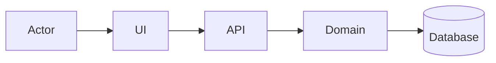
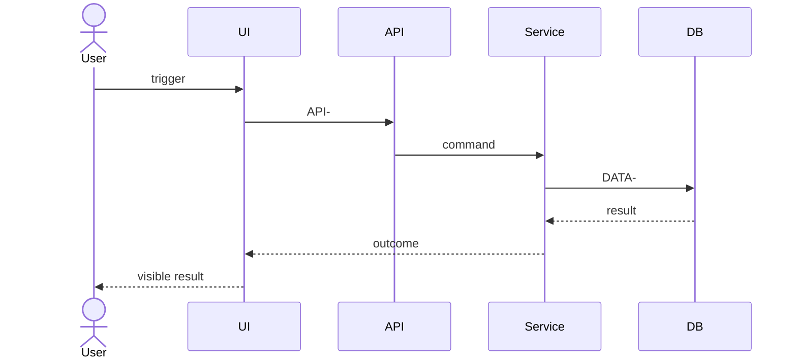

# Detailed Design — <System / Feature>

> Status: DRAFT — NOT READY / READY FOR INDEPENDENT REVIEW
> Version / commit:
> Owner / reviewers / approval authority:
> Readers: learner / implementer / reviewer

## 0. How to read

- Five-minute learner path:
- Implementer path:
- Reviewer path:
- ID legend and table of contents:

## 1. Executive summary and scope

### 1.1 Problem, outcome, goals, non-goals

### 1.2 Baseline, target, and gaps

### 1.3 Applicability, sources, assumptions, constraints

### 1.4 Canonical glossary

### 1.5 System summary diagram

Purpose and text alternative:

Read 1→N:
ID mapping:

### 1.6 Feature map

| F-ID | REQ/AC | Goal/result | Primary D-ID | UI/API/EVT | DATA | TEST | Section |
|---|---|---|---|---|---|---|---|

## 2. Context, components, deployment, and core lifecycle

Include focused Mermaid context/component/deployment/state views with purpose, guided reading, and ID mappings.

## 3. Feature implementation packets

Repeat for every F-ID.

### F-### — <Feature>

#### 3.x.1 Thirty-second summary

Goal/result, actor/trigger, prerequisites, permissions, REQ/AC.

#### 3.x.2 Primary diagram — D-F###-SEQ-01

Purpose, text alternative, read 1→N, and ID mapping.

#### 3.x.3 Frontend controls and client states

#### 3.x.4 API/events and field lineage

#### 3.x.5 Backend steps and ownership

#### 3.x.6 Data effects, transactions, concurrency, and indexes

#### 3.x.7 State, failure, retry, cancellation, compensation, and recovery

#### 3.x.8 Security, observability, quality, tests, and evidence

#### 3.x.9 Decisions, risks, and open items

## 4. Shared API/event contracts

Define each normative schema once.

## 5. Backend/runtime cross-cutting design

## 6. Physical data design and migration

Include source of truth, physical ER, every column/type/null/default, PK/FK actions, constraints, indexes, migration/empty DB order, backfill, rollback/restore, and query/DTO lineage.

## 7. Security, quality, deployment, operations, and disaster recovery

## 8. Verification, traceability, and review handoff

Include F/REQ/AC ↔ diagram ↔ UI/API/EVT ↔ backend ↔ data ↔ failure ↔ test ↔ runtime evidence coverage, Mermaid rendering status, learner blind read, implementer blind task, and independent review handoff.

## 9. Decisions, risks, open items, and evidence index

No independent appended report or companion file.