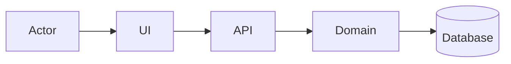
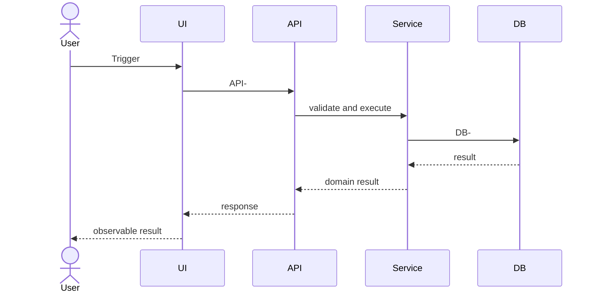

# <Project> — <Feature> AS-IS Full-Stack Detailed Design

> Reconstruction status: COMPLETE | PARTIAL | BLOCKED
> Repository / full commit:
> Purpose: learning / comparison / reuse baseline
> Readers: learner / equivalent implementer / reviewer
> AS-IS reconstruction does not authorize implementation in another product.

## 0. How to read this document

- Five-minute learner path:
- Implementer path:
- Reviewer path:
- Canonical terms and ID legend:
- Table of contents:

## 1. Executive summary and feature map

### 1.1 Scope, boundary, and source fingerprint

### 1.2 System summary structure

Purpose and text alternative:

Read 1→N:
Evidence/ID mapping:

### 1.3 Feature-to-diagram map

| F-ID | User goal/result | BEH IDs | Primary D-ID | API/EVT | DB objects | Section |
|---|---|---|---|---|---|---|

## 2. Mental model, glossary, and core lifecycle

### 2.1 Canonical glossary

### 2.2 Context/components/deployment

### 2.3 Core data relationship and lifecycle diagrams

## 3. Feature implementation packets

Repeat this complete packet for every F-ID.

### F-### — <feature>

#### 3.x.1 Thirty-second summary

- Goal/result:
- Trigger/actor:
- Preconditions/permission:
- Applicable variants:

#### 3.x.2 Primary behavior diagram — D-F###-SEQ-01

Purpose and text alternative:

Read 1→N:
Diagram ↔ F/BEH/API/EVT/DB/E mapping:

#### 3.x.3 Frontend and client states

#### 3.x.4 Exact API/event contracts

#### 3.x.5 Backend execution steps and ownership

#### 3.x.6 Data effects, field lineage, transactions, and indexes

#### 3.x.7 State, async, failure, concurrency, retry, cancellation, and recovery

#### 3.x.8 Security, observability, tests, and evidence

#### 3.x.9 Conflicts and unknowns

## 4. Shared API and event reference

Define each schema once; feature packets cross-reference IDs.

## 5. Backend and runtime cross-cutting design

## 6. Complete physical database design

### 6.1 Database topology and source of truth

### 6.2 Physical ER diagram

### 6.3 Complete schema per object

For every object list every column/type/null/default, PK generation, FK targets/actions/deferrability, unique/check/exclusion constraints, indexes/predicates/includes, sequences/enums/triggers/views, tenant/partition/retention, migration source, query/DTO lineage.

### 6.4 Empty-database construction, evolution, rollback, and restore

## 7. Security, build, deployment, operations, and recovery

## 8. Verification and equivalent-reproduction audit

### 8.1 F-ID/BEH/diagram/contract/data/test/evidence coverage

### 8.2 Mermaid rendering and cross-view consistency

### 8.3 Learner blind-read result

### 8.4 Implementer blind-task result

### 8.5 Final reconstruction status

## 9. Source defects, conflicts, unknowns, and evidence index

Embed ledgers here; do not append independent documents with their own H1 or numbering.